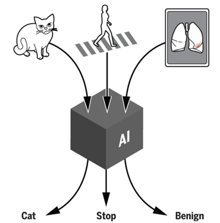

Hello world !

强化学习（Reinforcement Learning, RL）领域中有多种算法，这些算法可以根据其特性被分类为不同的类型。以下是几种主要的强化学习算法类别及其代表性算法：

1. 基于价值的方法（Value-based Methods）

这类方法旨在学习状态或动作的价值函数，然后根据这些值来选择行动。

Q-learning：一种离策略（off-policy）算法，通过学习一个动作价值函数（即Q函数），该函数可以告诉我们，在给定状态下采取某个动作后能获得的预期回报。
Deep Q-Network (DQN)：结合了Q-learning和深度学习，使用神经网络逼近Q函数。它引入了经验回放（experience replay）和目标网络（target network）等技术来提高稳定性和性能。
2. 基于策略的方法（Policy-based Methods）

这类方法直接在策略空间上进行搜索，优化策略本身而非先估计价值函数。

Policy Gradient Methods：如REINFORCE算法，通过梯度上升直接优化策略参数，使得采取的动作能够最大化预期回报。
Actor-Critic Methods：结合了基于价值和基于策略的优点，同时学习一个策略（actor）和一个价值函数（critic）。代表性的算法包括A3C（Asynchronous Advantage Actor-Critic）、A2C（Advantage Actor Critic）以及DDPG（Deep Deterministic Policy Gradient）。
3. 模型学习方法（Model-based Methods）

这种方法试图构建环境的模型，以便预测采取特定行动后的结果，并据此规划未来的行动。

Dynastic Programming (DP)：当环境的转移概率和奖励完全已知时使用，包括策略迭代和价值迭代等经典算法。
Monte Carlo Tree Search (MCTS)：虽然不是严格意义上的RL算法，但在某些情况下与RL结合使用，特别是在游戏AI中，比如AlphaGo就采用了这种方法。
4. 组合方法

有些算法尝试将上述不同类型的元素组合在一起，以利用各自的优势。

TRPO (Trust Region Policy Optimization) 和 PPO (Proximal Policy Optimization)：改进了策略梯度方法中的更新步骤，确保每次更新都足够保守，从而避免大幅度的性能下降。
其他值得注意的算法

SARSA：类似于Q-learning的一种算法，但它是一种在线(on-policy)算法，这意味着它使用当前策略生成的数据来进行学习。
Soft Actor-Critic (SAC)：一种最新的高效且稳定的算法，特别适用于连续动作空间的问题。
每种算法都有其适用场景和局限性，选择合适的算法通常取决于具体的应用背景、问题类型（如是否是离散或连续动作空间）、可用数据量等因素。随着研究的发展，新的算法和技术不断涌现，持续推动着强化学习领域的进步。

